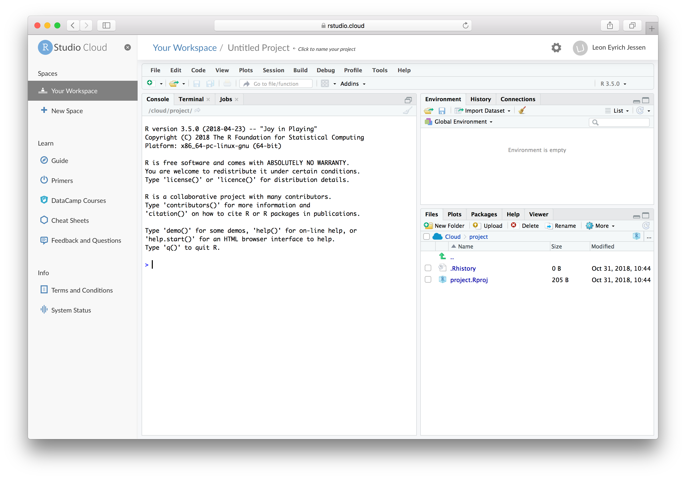
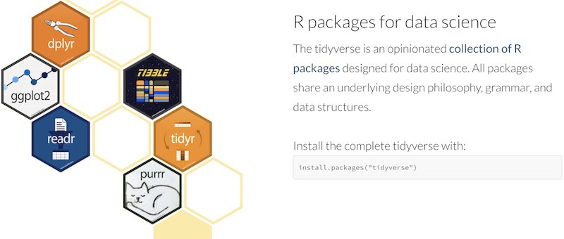
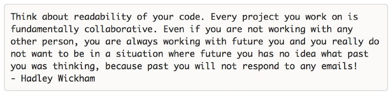
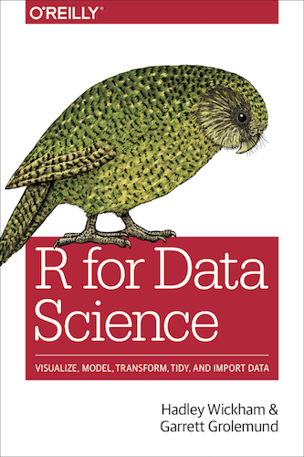

```{r setup, include=FALSE}
knitr::opts_chunk$set(echo = FALSE)
library('tidyverse')
```

# Getting Started

## Prerequisites

Hopefully, you are able to connect to the internet using one of the following options:

- DTU net if you are a student at DTU
- Eduroam if you are a student at another University
- DTU guest accounts (Arranged by CBIOvikings)
- Your phone as an access point

You should pair up with someone if:

- You do not have a working `R/RStudio` installation _or_
- You do not have an `RStudio Cloud` account
- If you are _completely_ new to `R`

As this will be a rather intense workshop, prior experience with `R` will be an advantage. If you feel overwhelmed, do not dispare, lectures and exercises will be available to be revisited after the workshop.

## Workshop Information

- The workshop is hosted and arranged by the bioinformatics student associations 'CBIOvikings'
- A big thanks to Nikolaj Pagh Kristensen for inviting us here today
- Lecturers are
    - Johannes Eichler Waage, PhD in Bioinformatics, Senior Data Scientist, PFA
    - Leon Eyich Jessen, PhD in Bioinformatics, Postdoc, DTU Bioinformatics

## Briefly on R

- [The R Project for Statistical Computing](https://www.r-project.org/) is a programming language scoped at applied data analysis ('the engine')
- [RStudio](https://www.rstudio.com/) is an Integrated Developer Environment (IDE) facilitating easy interaction with `R` ('the car')

## Briefly on R

```{r, out.width = "800px", fig.align="center"}

```

# Introduction to Tidyverse

## What is tidyverse?

```{r, out.width = "800px", fig.align="center"}

```

## What is tidy data?

You spend your time getting the data into a specific format 'tidy data':

 - Each column is `one` variable
 - Each row is `one` observation
 - Each cell is `one` value

...and then you can apply the plethora of tidyverse tools!

## What is the aim of Tidyverse?

Base

```{r base, echo=TRUE, eval=FALSE}
median(sort(round(sample(rnorm(100,mean=2),10),3)))
```

Tidy

```{r tidy, echo=TRUE, eval=FALSE}
100 %>% rnorm(mean=2) %>% sample(10) %>% round(3) %>% sort %>% median
```

 - Same result, but...
 - From virtually unreadable to self explanatory code
 - Code readability: _"Programs must be written for people to read, and only incidentally for machines to execute"_ [Abelson, H., Sussman, G.J. & Sussman, J.  __Structure and Interpretation of Computer Programs__, 1996]

## Why code readability?

```{r, out.width = "800px", fig.align="center"}

```

## The pipe ` %>% `

 - Familiar to anyone used to using *nix systems
 - Simple, yet extremely powerful
 - The pipe separates two function feeding the output from the left hand function in as input to the right hand function

```{r the_pipe, echo=TRUE, eval=FALSE}
100 %>% rnorm(mean=2) %>% sample(10) %>% round(3) %>% sort %>% median
```

```{r the_pipe_details, echo=TRUE, eval=TRUE}
input  = 100;
output = rnorm(input,mean=2); input = output
output = sample(input,10);    input = output
output = round(input,3);      input = output
output = sort(input);         input = output
output = median(input)
output
```

## The one book you need

```{r, out.width = "300px", fig.align="center"}

```

## On the speed

 - Tidyverse is written in C++
 - Tidyverse reduces long pipelines (like you would with a long equation)
 - Tidyverse is fast (Case-dependent, but comparable to Python)

# Questions and comments so far?
