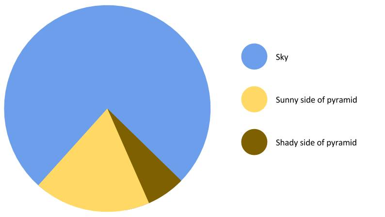

```{r setup, include=FALSE}
knitr::opts_chunk$set(echo = FALSE)
set.seed(978552)
library('tidyverse')
library('readxl')
```

# Before we move into ggplot

## Wide vs long data format

```{r, echo=TRUE}
wide_data = tibble(samples = str_c('smpl_', 1:5), var_1 = round(rnorm(5),2),
                   var_2 = round(rnorm(5),2), var_3 = round(rnorm(5),2))
wide_data
```

Recall, I told you that each row is an observation and each column is a variable? Well...

## There is another Skywalker (Sorry)

We can convert the wide format to what is known as long format like so:

```{r, echo=TRUE}
long_data = wide_data %>% gather(key = var, value = value, -samples)
long_data
```

## Long format

This is particular useful if you have longitudinal data, as it allows you to flatten the data from a cube with time slices to a matrix. Example:

```{r, echo=TRUE}
wide_data_t1 = tibble(samples = str_c('smpl_', 1:3), var_1 = round(rnorm(3),2),
                      var_2 = round(rnorm(3),2))
wide_data_t2 = tibble(samples = str_c('smpl_', 1:3), var_1 = round(rnorm(3),2),
                      var_2 = round(rnorm(3),2))
wide_data_t3 = tibble(samples = str_c('smpl_', 1:3), var_1 = round(rnorm(3),2),
                      var_2 = round(rnorm(3),2))
```

Add a `time point` variable

```{r, echo=TRUE}
wide_data_t1 = wide_data_t1 %>% mutate(time_point = 1)
wide_data_t2 = wide_data_t2 %>% mutate(time_point = 2)
wide_data_t3 = wide_data_t3 %>% mutate(time_point = 3)
```

Bind the three data frames and convert to long format

```{r, echo=TRUE}
long_data_t = bind_rows(wide_data_t1, wide_data_t2, wide_data_t3) %>%
  gather(key = var, value = value, -samples, -time_point)
```

## Long format

```{r, echo=TRUE}
long_data_t
```

## Long format

Depending on what you want to visualise, these long-to-wide or wide-to-long conversion, may have to be used.

So, let us just convert the `long_data_t` back to wide format, so you can see how that is done:

```{r, echo=TRUE}
long_data_t %>% spread(key = var, value = value)
```

## Summary - Long and wide data

- Convert from wide to long: `gather()`
- Convert from long to wide: `spread()`

See previous slides for examples.

Moving on to data visualisation...

# Data Visualisation using ggplot

## Cliché: A picture says more than 1,000 numbers

Except

## Cliché: A picture says more than 1,000 numbers

Except pie charts... This, this is the only valid use of a pie chart I have seen:

```{r, out.width = "600px", fig.align="center"}

```

## What is `ggplot`?

- The 'gg' in `ggplot` stands for Grammar-of-Graphics.

- "A grammar of graphics is a tool that enables us to concisely describe the components of a graphic" [Hadley Wickham. A layered grammar of graphics. Journal of Computational and Graphical Statistics, vol. 19, no. 1, pp. 3–28, 2010.]((http://vita.had.co.nz/papers/layered-grammar.html)) 

- So, a structured framework for building graphical representations of data

- Let us start with some examples

## Example data for data visualisation 

We will use the `ToothGrowth` data set "The Effect of Vitamin C on Tooth Growth in Guinea Pigs", 60 observations of 3 variables:

-	`len`, numeric, Tooth length
- `supp`, factor, Supplement type (VC = ascorbic acid or OJ = Orange Juice)
- `dose`, numeric, Dose in milligrams/day

```{r, echo=TRUE}
ToothGrowth %>% head(5)
```

## Example data for data visualisation

We can use the `count()` function to investigate how the 60 Guniea Pigs are distributed in the `supp` and `dose` groups:

```{r, echo=TRUE}
ToothGrowth %>% count(supp, dose)
```

## A basic barchart

We can visulise the counts using a simple barchart:

```{r, echo=TRUE, out.width = "600px", fig.align="center"}
ToothGrowth %>% count(dose, supp) %>%
  ggplot(aes(x = dose, y = n, fill = supp)) +
  geom_col(position = 'dodge')
```

## A basic scatterplot

```{r, echo=TRUE, out.width = "600px", fig.align="center"}
ToothGrowth %>%
  ggplot(mapping = aes(x = dose, y = len)) +
  geom_point()
```

It seems that dose has an effect (Note how layers are added using `+`), let us look at it in another way

## A basic boxplot

```{r, echo=TRUE, out.width = "600px", fig.align="center"}
ToothGrowth %>%
  ggplot(mapping = aes(x = dose, y = len, group = dose)) +
  geom_boxplot()
```
Looks better, but it is difficult to make out the underlying distributions

## A basic histogram

```{r, echo=TRUE, out.width = "600px", fig.align="center"}
ToothGrowth %>%
  ggplot(mapping = aes(x = len, fill = factor(dose))) +
  geom_histogram(alpha = 0.5, binwidth = 3)
```

Not very informative, let us look at a density plot instead

## A basic density plot

```{r, echo=TRUE, out.width = "600px", fig.align="center"}
ToothGrowth %>% ggplot(mapping = aes(x = len, fill = factor(dose))) + geom_density(alpha = 0.5)
```

It is a bit messy, that the densities are covering each other, try a violin plot

## A basic violinplot

```{r, echo=TRUE, out.width = "600px", fig.align="center"}
ToothGrowth %>%
  ggplot(mapping = aes(x = dose, y = len, group = dose)) +
  geom_violin()
```

But wait, we have different types of supplements

## A grouped violinplot

```{r, echo=TRUE, out.width = "600px", fig.align="center"}
ToothGrowth %>%
  ggplot(mapping = aes(x = factor(dose), y = len, fill = supp)) +
  geom_violin()
```

It seems, that not only is there an effect of dose, but also the supplement type

## A grouped boxplot

```{r, echo=TRUE, out.width = "600px", fig.align="center"}
ToothGrowth %>%
  ggplot(mapping = aes(x = factor(dose), y = len, fill = supp)) +
  geom_boxplot()
```

## A scatter plot with groups and models

```{r, echo=TRUE, out.width = "600px", fig.align="center"}
ToothGrowth %>%
  ggplot(mapping = aes(x = dose, y = len, colour = supp)) +
  geom_point() +
  geom_smooth(method = "lm")
```

## A scatter plot with facets, models and densities

```{r, echo=TRUE, out.width = "600px", fig.align="center"}
ToothGrowth %>%
  ggplot(mapping = aes(x = dose, y = len)) +
  geom_violin(mapping = aes(x = dose, y = len, group = dose)) +
  geom_point() +
  geom_smooth(method = "lm") +
  facet_wrap(~supp, nrow = 1)
```

## In summary

We hope it is evident just how easy ggplot makes publication ready data viualisations and how readable the code is!

Now, it is time for exercises!
